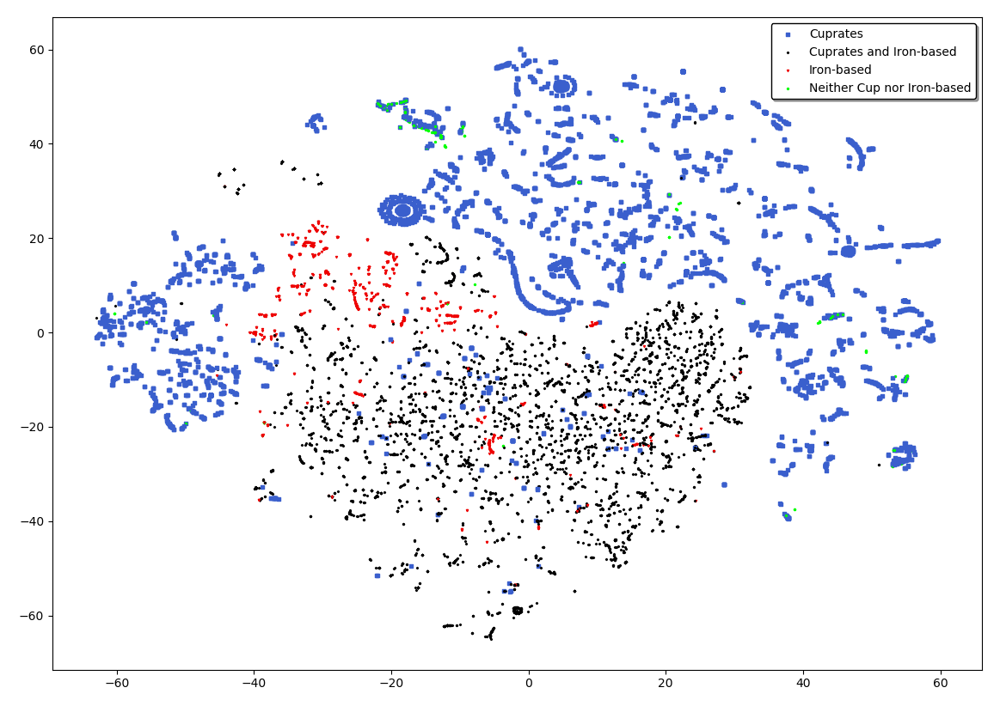

## Forked from

- [https://mekhub.cn/danyabo/superconductor/tree/master](https://mekhub.cn/danyabo/superconductor/tree/master)


## Benchmark Datasets for Superconductor Tc Prediction

- [DataH](https://mekhub.cn/danyabo/superconductor/blob/master/Dataset/DataH.csv)
- [DataV](https://mekhub.cn/danyabo/superconductor/blob/master/Dataset/DataV.csv)
- [DataK](https://mekhub.cn/danyabo/superconductor/blob/master/Dataset/DataK.csv)


## Trained Environment

- Intel Core i5 7200U
- DDR4 8GB RAM
  
  Training tooks 5 hours.

## How to run
Train: (default) step:700 times:700 batch_size:32 
```
python Conv_feature_extract.py --data Dataset/DataK.csv
```

Test(provided by origin)
```
python ConvGBDT.py --data Dataset/DataV.csv --model_name check_point/DataV/best_model.ckpt.meta --model_path check_point/DataV
```
Test(trained by own)
```
python ConvGBDT.py --data Dataset/DataV.csv --model_name check_point_k/model_0/best_model.ckpt.meta --model_path check_point_k/model_0/DataV
```

Visualization(example code)
```
python visualization.py --data Dataset/DataK.csv --model_name check_point_k/model_0/best_model.ckpt.meta --model_path check_point_k/model_0
```


<center> option : model_(number) (number = 0,1,2,..., 8,9) </center>

## 

